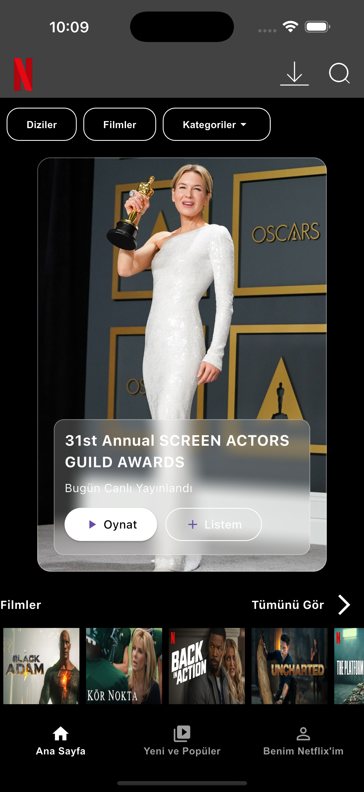
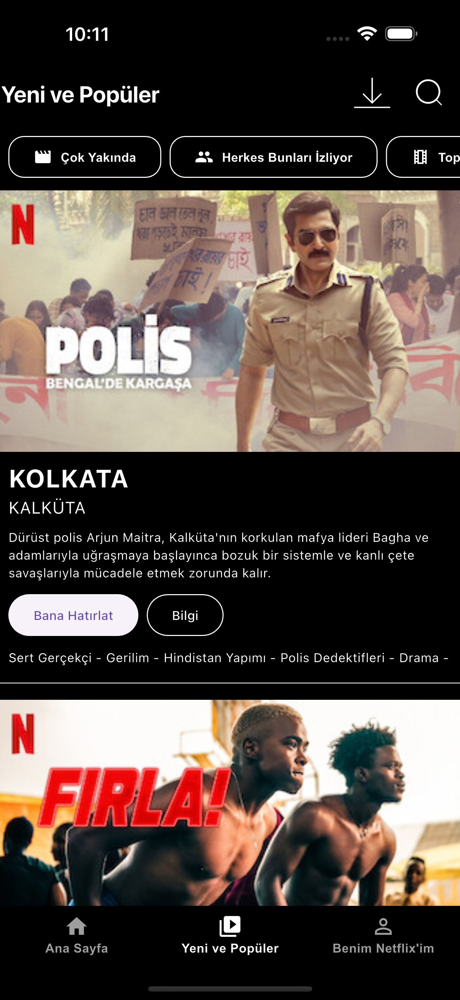
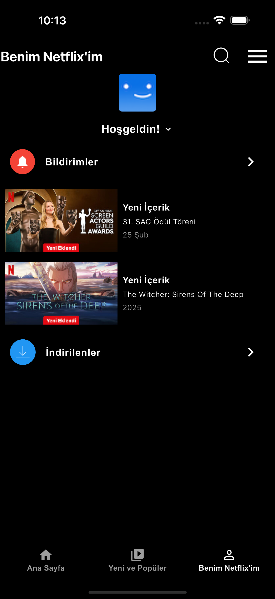

# netflix_clone_app

A Netflix clone app by Mert Atay for App Inovation Mobile Journey Bootcamp

## Getting Started

Bu proje Flutter framework kullanılarak gerçekleştirilmiş bir klon uygulama projesidir. Temel seviyede geliştirdiğimiz bu uygulamada 3 adet ekranımız bulunmaktadır.

- Ana Ekran
- Yeni ve Popüler ekranı
- Benim Netflix'im ekranı

olmak üzere 3 adet ekrandan oluşmaktadır. Tasarım olarak indirme ve search ikonları Figma üzerinden gerçekleştirilmiştir.

Başlatmak içib:

- Öncelikle repoda bulunan debug apk'sını kuramnız gerekmektedir. Bunu versiyon son halde olarak build etmiş olacağım. Ama eğer bir geliştirici iseniz
Android Studio üzerinden Flutter eklentisi kurup, Open Project kısmından git versiyon kontrol ile getiri seçip projeyi forklayabilirsiniz.

# Ekran Görüntüleri

- Ana Ekran

- Yeni ve Popüler Ekranı

- Benim Netflix'im Ekranı

